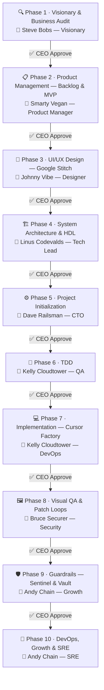

# Autonomous AI Venture Studio

> Local-first, stateful software factory that drives an idea through a strict 10-phase SDLC pipeline — from Vision to deployed MVP — with CEO approval gates at every step.

---

## Overview

The AI Venture Studio is a **LangGraph**-powered state machine that orchestrates AI agents through ten sequential phases (Vision → Backlog → UI/UX → Architecture → Init → TDD → Implementation → Visual QA → Guardrails → DevOps). Each phase generates deterministic artifacts, then pauses via `interrupt()` until the CEO approves in **Telegram**. State is persisted in **PostgreSQL** (via LangGraph's `AsyncPostgresSaver`), enabling resume-after-restart and full rollback to any prior checkpoint.

LLM calls go to a **local Ollama** instance (default `llama3.1:8b`) — no OpenAI or Anthropic dependency. Phase 3 optionally calls **Google Stitch** for UI prototypes when enabled.

---

## 10-Phase Pipeline



| # | Persona | Phase | Key Output |
|---|---------|-------|------------|
| 1 | 👤 Steve Bobs — Visionary | Visionary & Business Audit | `Business_Logic.md`, USP, monetization, delivery surface |
| 2 | 👤 Smarty Vegan — Product Manager | Product Management (Backlog & MVP) | `Product_Backlog.md`, `MVP_Scope.md`, epics + acceptance criteria |
| 3 | 👤 Johnny Vibe — Designer | UI/UX Design (Google Stitch) | `Design_System.md`, `Design_Tokens.json`, prototype link + screenshots |
| 4 | 👤 Linus Codevalds — Tech Lead | System Architecture & HDL | `System_Architecture.md`, `HDL_Business_Flows.md` |
| 5 | 👤 Dave Railsman — CTO | Project Initialization | Repo scaffold, Docker Compose, CI baseline |
| 6 | 👤 Kelly Cloudtower — QA | TDD | `Test_Report.md`, P0 test suite (`make test` passes) |
| 7 | 👤 Kelly Cloudtower — DevOps | Implementation (Cursor Factory) | Working MVP features, Cursor Composer-driven multi-file changes |
| 8 | 👤 Bruce Securer — Security | Visual QA & Patch Loops | `QA_Report.md`, evidence packs (`expected/actual/diff.png`) |
| 9 | 👤 Andy Chain — Growth | Guardrails (Sentinel & Vault) | `Security_Policy.md`, `Budget_Guardrails.md`, secrets scan |
| 10 | 👤 Andy Chain — SRE | DevOps, Growth & SRE | `Operations_Runbook.md`, deploy configs, monitoring, launch checklist |

No phase advances without an explicit **[✅ APPROVE]** from the CEO in Telegram.

---

## Architecture

```
Telegram bot (/run <idea>)
       │
       ▼
LangGraph graph.ainvoke(...)
       │
  ┌────┴────────────────────────────────────────────┐
  │  Phase 1 → 2 → 3 → … → 10                      │
  │  Each node: Ollama prompt → parse → write        │
  │  artifacts → interrupt() → wait for approval     │
  └────────────────────────────────────────────────-─┘
       │ Command(resume={"approved": True})
       │ (CEO presses APPROVE in Telegram)
       ▼
PostgreSQL (AsyncPostgresSaver)
  ├── LangGraph checkpoints (per thread_id)
  └── Artifact documents + revisions

artifacts/<thread_id>/
  ├── docs/          ← markdown/JSON exports
  ├── assets/ui/     ← Stitch screenshots
  ├── visual-qa/     ← evidence packs (Phase 8)
  └── snapshots/     ← rollback tarballs
```

**Key components:**

- `src/graph/workflow.py` — compiles the 10-node LangGraph graph
- `src/graph/nodes.py` — per-phase AI logic (Ollama prompts + parsing + artifact writing)
- `src/graph/state.py` — `PhaseState` TypedDict shared across all nodes
- `src/telegram_bot/bot.py` — Aiogram bot, inline keyboards, callback handlers
- `src/persistence/postgres.py` — `AsyncPostgresSaver` setup + connection pool
- `src/integrations/stitch_client.py` — Google Stitch API client (Phase 3)

---

## Tech Stack

| Component | Technology |
|-----------|------------|
| Orchestration | LangGraph + `langgraph-checkpoint-postgres` |
| Control plane | Aiogram 3 (Telegram bot) |
| State persistence | PostgreSQL (via `psycopg` + `AsyncPostgresSaver`) |
| LLM | Local Ollama (`llama3.1:8b` default) |
| UI design (Phase 3) | Google Stitch |
| Runtime | Python 3.11+ |
| Containerization | Docker + Docker Compose |
| Linting | Ruff |
| Testing | pytest + pytest-asyncio |

---

## Prerequisites

- **Docker** and **Docker Compose** (primary runtime — no local Python required)
- **Ollama** running locally with at least `llama3.1:8b` pulled (`ollama pull llama3.1:8b`)
- A **Telegram bot token** (create via [@BotFather](https://t.me/BotFather))
- A **PostgreSQL** connection string (or let Docker Compose spin one up)
- _(Optional)_ **Google Stitch API key** for Phase 3 UI generation; set `GOOGLE_STITCH_ENABLED=false` to use the text-only fallback

---

## Quick Start

```bash
# 1. Clone and configure
git clone https://github.com/maximcoding/ai-venture-studio.git
cd ai-venture-studio
cp .env.example .env
# Edit .env — fill in PG_CONNECTION_STRING and TELEGRAM_BOT_TOKEN at minimum

# 2. Boot the full stack (app + Postgres)
make boot

# 3. Open Telegram, find your bot, and run:
# /run Build a SaaS tool that helps freelancers track invoices
```

---

## Commands

| Command | Description |
|---------|-------------|
| `make boot` | Build and start the app + Postgres containers |
| `make test` | Run the full test suite inside Docker |
| `make lint` | Run Ruff check + format check |
| `make shell` | Open a shell inside the app container |
| `make install` | Create local `.venv` (Python 3.11+ required on host) |
| `make local-test` | Run pytest in the local `.venv` |
| `make local-lint` | Run Ruff in the local `.venv` |

Run a single test:

```bash
make shell
python -m pytest tests/test_graph.py -k <test_name> -v
```

---

## Environment Variables

| Variable | Required | Default | Description |
|----------|----------|---------|-------------|
| `PG_CONNECTION_STRING` | Yes | — | PostgreSQL DSN for checkpoints and artifacts |
| `TELEGRAM_BOT_TOKEN` | Yes | — | Token from @BotFather |
| `OLLAMA_BASE_URL` | No | `http://host.docker.internal:11434` | Ollama API endpoint |
| `OLLAMA_MODEL` | No | `llama3.1:8b` | Model to use for all AI phases |
| `OLLAMA_TIMEOUT` | No | `120` | Seconds before Ollama request times out |
| `GOOGLE_STITCH_ENABLED` | No | `true` | Set to `false` to skip Stitch and use text fallback |
| `GOOGLE_STITCH_API_KEY` | Phase 3 | — | Required if `GOOGLE_STITCH_ENABLED=true` |
| `GOOGLE_STITCH_BASE_URL` | No | `https://stitch.google.com` | Stitch API base URL |
| `GOOGLE_STITCH_TIMEOUT` | No | `120` | Seconds before Stitch request times out |

---

## Project Structure

```
ai-venture-studio/
├── src/
│   ├── core/          # Config loading (core/config.py) — no os.getenv elsewhere
│   ├── graph/         # LangGraph workflow, nodes, and PhaseState
│   ├── integrations/  # External API clients (Google Stitch)
│   ├── persistence/   # AsyncPostgresSaver setup + connection pool
│   ├── telegram_bot/  # Aiogram bot, keyboards, callback handlers
│   └── main.py        # Boot sequence: DB → graph → bot
├── tests/             # pytest suite
├── infra/
│   ├── Dockerfile
│   └── docker-compose.yml
├── docs/              # SSOT factory manuals (phase specs, never run artifacts)
│   ├── PHASES_INDEX.md
│   ├── PHASE_01_*.md … PHASE_10_*.md
│   └── Foundation_Template.md
├── artifacts/         # Per-session run outputs (gitignored)
│   └── <thread_id>/
│       ├── docs/
│       ├── assets/ui/
│       ├── visual-qa/
│       └── snapshots/
├── refs/              # Read-only donor repos for pattern extraction
├── .env.example       # Environment template
├── Makefile
└── pyproject.toml
```

> **SSOT rule:** `/docs` contains factory manuals only. Never write per-run output there. Per-session artifacts belong in `artifacts/<thread_id>/` (canonical store is PostgreSQL).

---

## Extending the Pipeline

- **Add AI logic to an existing phase:** Edit the corresponding `phase_N` function in `src/graph/nodes.py`. Follow the Phase 1/2/3 pattern: read prior-phase artifacts → build Ollama prompt → parse with `---DOCUMENT_SEPARATOR---` → write to `artifacts/<thread_id>/docs/` → `interrupt(...)`.
- **Add a new Telegram button or refinement flow:** Extend `_approval_keyboard` in `src/telegram_bot/bot.py` and add a callback handler that resumes the graph with `Command(resume={...})`.
- **Add a new external integration:** Create a client under `src/integrations/`, gate it behind a `*_ENABLED` flag in `src/core/config.py`, and implement a text-only fallback (see Phase 3 as the reference implementation).

---

## Time Machine (Rollback)

To roll back to any prior approved phase:

1. Restore the LangGraph checkpoint from PostgreSQL.
2. Preserve current state: create a `draft/<timestamp>` git branch (if a remote exists) or snapshot to `artifacts/<thread_id>/snapshots/`.
3. Apply CEO edits to run documents (DB revisions; filesystem export is optional).
4. Recompute downstream phases and re-run validations before requesting re-approval.

---

## License

MIT
